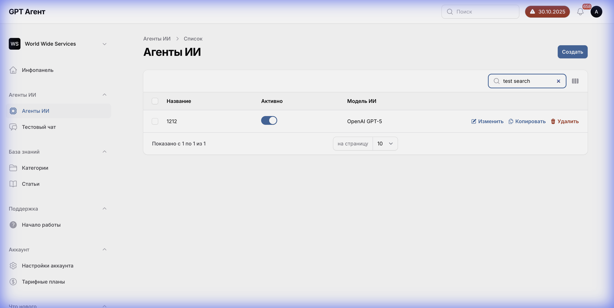

# Главная страница: Список Агентов

## Обзор
Страница отображает список всех созданных AI-агентов с возможностью поиска, фильтрации и управления ими.

**URL**: `/manage/{account_id}/ai-agents`

---

## 1. Структура страницы

### 1.1 Заголовок
- **Название раздела**: "Агенты ИИ"
- **Кнопка действия**: "Создать" (Primary Blue) - открывает страницу создания агента.

### 1.2 Фильтры и Поиск
- **Поле поиска**:
  - Placeholder: "Поиск"
  - Поведение: Мгновенная фильтрация при вводе (debounce).
  - URL параметр: `?tableSearch={query}`
- **Индикация пустого поиска**: Текст "Не найдено Агенты ИИ".

### 1.3 Таблица агентов
Таблица содержит следующие колонки:

1. **Название**
   - Ссылка на страницу редактирования агента.
   - Жирный шрифт.

2. **Активно**
   - Статус агента (Toggle switch или иконка).
   - Отображает текущее состояние (Включен/Выключен).

3. **Модель ИИ**
   - Название используемой модели (например, "OpenAI GPT-5").
   - Текст серого цвета.

### 1.4 Действия (Row Actions)
Для каждой строки доступны действия (отображаются inline или при наведении):
- **Изменить** (Edit): Переход к редактированию.
- **Копировать** (Duplicate): Создание копии агента.
- **Удалить** (Delete): Удаление агента (с подтверждением).

### 1.5 Пагинация
Расположена внизу таблицы.
- Текст: "Показано с X по Y из Z".
- Выпадающий список: "Показывать по X строк".
- Кнопки навигации: "Предыдущая", "Следующая".

---

## 2. Навигационное меню (Sidebar)

Боковая панель содержит следующие разделы:

1. **Инфопанель** (Dashboard)
2. **Агенты ИИ** (AI Agents) - Текущий активный раздел.
   - Подпункты: Агенты ИИ, Тестовый чат.
3. **База знаний** (Knowledge Base)
   - Подпункты: Категории, Статьи.
4. **Поддержка** (Support)
   - Подпункты: Начало работы.
5. **Аккаунт** (Account)
   - Подпункты: Настройки аккаунта, Тарифные планы.
6. **Что нового** (What's new)

---

## 3. Поведение

- **Загрузка**: При переходе отображается скелетон или спиннер.
- **Пустое состояние**: Если агентов нет, отображается иллюстрация и кнопка "Создать агента" по центру.
