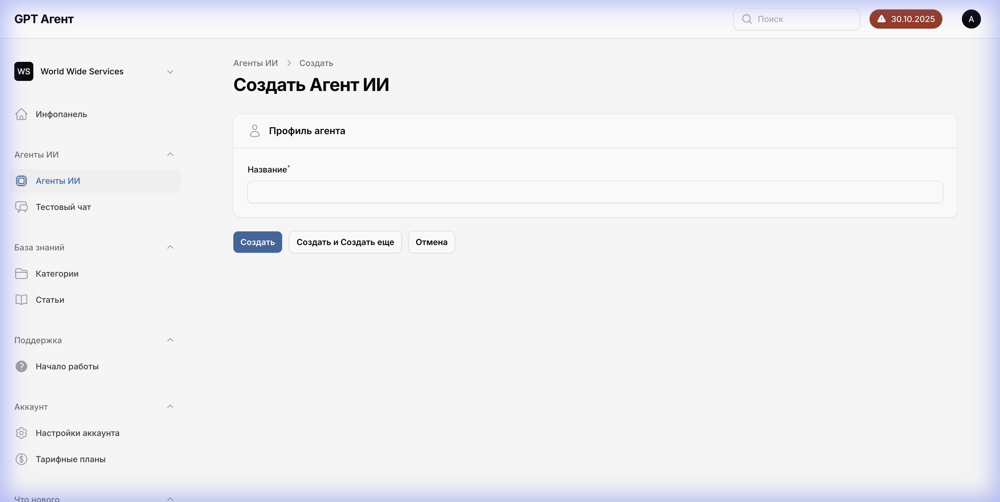
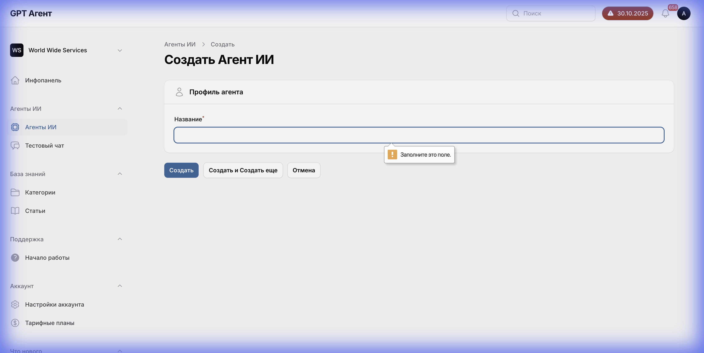

# Страница Создания Агента

## Обзор
Страница для создания нового AI-агента. На данный момент содержит минимальный набор полей для быстрой инициализации.

**URL**: `/manage/{account_id}/ai-agents/create`

---

## 1. Форма создания

### 1.1 Поля формы
На странице присутствует только одно обязательное поле:

1. **Название** (Name)
   - Тип: Text Input
   - Label: "Название"
   - Обязательное: Да
   - Валидация: При попытке создания с пустым полем отображается ошибка "Обязательно для заполнения."

### 1.2 Кнопки действий
Расположены в верхней части формы (Header):

1. **Создать** (Primary)
   - Цвет: Blue (`#0369a1`)
   - Действие: Создает агента и перенаправляет на страницу редактирования.
   
2. **Отмена** (Secondary/Link)
   - Цвет: Gray
   - Действие: Возвращает на список агентов без сохранения.

---

## 2. Валидация

При нажатии кнопки "Создать" без заполнения названия:
- Поле подсвечивается красным (border color).
- Под полем появляется текст ошибки красного цвета: "Обязательно для заполнения."

---

## 3. Поведение

- **Успешное создание**:
  1. Отправляется POST запрос.
  2. Пользователь перенаправляется на страницу редактирования созданного агента (`/ai-agents/{new_agent_id}`).
  3. Отображается уведомление об успехе (Toast).

- **Отмена**:
  1. Возврат на `/ai-agents`.
