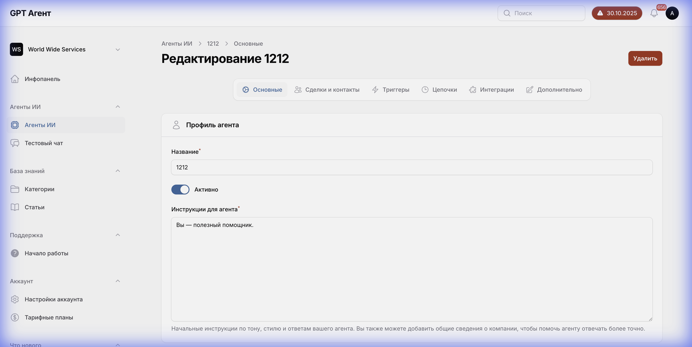

# Вкладка "Основные" (Main Tab)



## Общее описание
Вкладка "Основные" содержит базовые настройки AI-агента, включая название, статус активности и инструкции для агента.

## Структура интерфейса

### Навигация (Tabs)
Горизонтальное меню вкладок в верхней части страницы:
- **Основные** (активная вкладка)
- Сделки и контакты
- Триггеры
- Цепочки
- Интеграции
- Дополнительно

### Элементы формы

#### 1. Поле "Название агента" (Agent Name)
- **Тип**: Текстовое поле ввода
- **Расположение**: Верхняя часть формы
- **Label**: "Название агента"
- **Текущее значение**: "1212"
- **Обязательность**: Да (предположительно)
- **Валидация**: Текстовое поле для ввода имени агента
- **Источник данных**: Локальное поле, сохраняется в БД
- **Функционал**: Позволяет задать уникальное имя для идентификации агента

#### 2. Переключатель "Агент активен" (Agent Active)
- **Тип**: Toggle switch (переключатель)
- **Расположение**: Справа от названия агента
- **Label**: "Агент активен"
- **Текущее состояние**: Включен (ON)
- **Возможные состояния**:
  - ON (зеленый) - агент активен и работает
  - OFF (серый) - агент неактивен
- **Функционал**: Включает/выключает работу агента
- **Зависимости**: При выключении агент перестает обрабатывать запросы

#### 3. Поле "Инструкции" (Instructions)
- **Тип**: Многострочное текстовое поле (textarea)
- **Расположение**: Основная часть формы, под полем названия
- **Label**: "Инструкции"
- **Placeholder/Hint**: "Опишите, как должен вести себя агент, какие задачи выполнять и какой стиль общения использовать"
- **Текущее значение**: Пустое
- **Размер**: Большое поле для ввода подробных инструкций
- **Обязательность**: Рекомендуется
- **Валидация**: Текстовое поле без ограничений по длине (предположительно)
- **Источник данных**: Локальное поле, сохраняется в БД
- **Функционал**: Определяет поведение и стиль общения AI-агента
- **Примечание**: Это ключевое поле для настройки "личности" и функционала агента

### Кнопки действий

#### Кнопка "Сохранить" (Save)
- **Расположение**: Правый верхний угол страницы
- **Тип**: Primary button (основная кнопка)
- **Цвет**: Синий
- **Функционал**: Сохраняет все изменения в настройках агента
- **Состояния**:
  - Активна - когда есть несохраненные изменения
  - Неактивна - когда изменений нет
  - Загрузка - во время сохранения

## Логика работы

### Сценарий использования
1. Пользователь вводит название агента
2. Пользователь активирует/деактивирует агента через переключатель
3. Пользователь вводит подробные инструкции для агента
4. Пользователь нажимает "Сохранить"
5. Данные отправляются на сервер и сохраняются в БД

### Валидация
- Название агента: не должно быть пустым
- Инструкции: рекомендуется заполнить, но не обязательно

### API взаимодействие
- **Endpoint**: `PUT /api/agents/{agentId}` (предположительно)
- **Payload**:
  ```json
  {
    "name": "string",
    "active": boolean,
    "instructions": "string"
  }
  ```

## Зависимости
- Статус "Агент активен" влияет на работу агента во всех других модулях
- Инструкции используются AI-моделью для формирования ответов

## Состояния интерфейса
1. **Режим просмотра**: Все поля заполнены сохраненными данными
2. **Режим редактирования**: Пользователь изменяет поля
3. **Режим сохранения**: Показывается индикатор загрузки
4. **Режим ошибки**: Показываются сообщения об ошибках валидации
