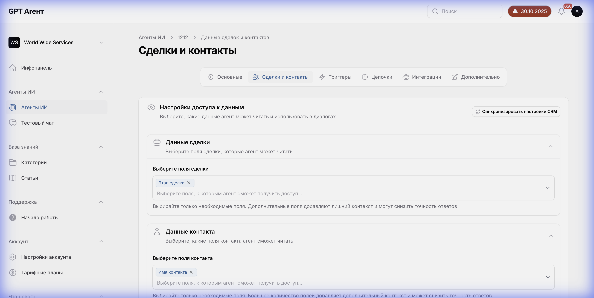

# Вкладка "Сделки и контакты" (Leads and Contacts Tab)



## Общее описание
Вкладка "Сделки и контакты" управляет доступом AI-агента к данным CRM системы. Здесь настраивается, какие поля сделок и контактов будут доступны агенту для чтения и анализа.

## Структура интерфейса

### Секция "Сделки" (Leads)

#### Заголовок секции
- **Текст**: "Сделки"
- **Описание**: "Выберите поля сделок, к которым агент будет иметь доступ"

#### Элементы управления

##### 1. Выпадающий список выбора полей сделок
- **Тип**: Multi-select dropdown (множественный выбор)
- **Расположение**: Под заголовком "Сделки"
- **Placeholder**: "Выберите поля сделок"
- **Функционал**: Позволяет выбрать одно или несколько полей сделок из CRM
- **Источник данных**: API CRM системы (Kommo/amoCRM)
- **Возможные значения**: Динамический список полей из CRM:
  - Название сделки
  - Бюджет
  - Статус
  - Ответственный
  - Дата создания
  - Дата закрытия
  - Теги
  - Воронка
  - Этап воронки
  - Пользовательские поля (custom fields)

##### 2. Выбранные поля сделок
- **Тип**: Список чипов (chips/tags)
- **Расположение**: Под выпадающим списком
- **Функционал**: Отображает выбранные поля
- **Взаимодействие**: Каждый чип имеет кнопку "×" для удаления поля из списка
- **Текущее состояние**: Пусто (поля не выбраны)

---

### Секция "Контакты" (Contacts)

#### Заголовок секции
- **Текст**: "Контакты"
- **Описание**: "Выберите поля контактов, к которым агент будет иметь доступ"

#### Элементы управления

##### 1. Выпадающий список выбора полей контактов
- **Тип**: Multi-select dropdown (множественный выбор)
- **Расположение**: Под заголовком "Контакты"
- **Placeholder**: "Выберите поля контактов"
- **Функционал**: Позволяет выбрать одно или несколько полей контактов из CRM
- **Источник данных**: API CRM системы (Kommo/amoCRM)
- **Возможные значения**: Динамический список полей из CRM:
  - Имя
  - Фамилия
  - Email
  - Телефон
  - Должность
  - Компания
  - Теги
  - Дата создания
  - Ответственный
  - Пользовательские поля (custom fields)

##### 2. Выбранные поля контактов
- **Тип**: Список чипов (chips/tags)
- **Расположение**: Под выпадающим списком
- **Функционал**: Отображает выбранные поля
- **Взаимодействие**: Каждый чип имеет кнопку "×" для удаления поля из списка
- **Текущее состояние**: Пусто (поля не выбраны)

---

## Логика работы

### Сценарий использования

#### Выбор полей сделок:
1. Пользователь кликает на выпадающий список "Выберите поля сделок"
2. Система загружает список доступных полей из CRM через API
3. Отображается список полей с чекбоксами
4. Пользователь выбирает нужные поля (можно выбрать несколько)
5. Выбранные поля отображаются как чипы под выпадающим списком
6. Пользователь может удалить поле, нажав на "×" на чипе

#### Выбор полей контактов:
1. Аналогично выбору полей сделок
2. Независимый список полей для контактов

#### Сохранение:
1. Пользователь нажимает кнопку "Сохранить" (в правом верхнем углу)
2. Данные отправляются на сервер
3. Агент получает доступ только к выбранным полям

### API взаимодействие

#### Получение списка полей CRM:
- **Endpoint**: `GET /api/crm/fields/leads` (для сделок)
- **Endpoint**: `GET /api/crm/fields/contacts` (для контактов)
- **Response**:
  ```json
  {
    "fields": [
      {
        "id": "field_id",
        "name": "Название поля",
        "type": "string|number|date|...",
        "is_custom": boolean
      }
    ]
  }
  ```

#### Сохранение выбранных полей:
- **Endpoint**: `PUT /api/agents/{agentId}/crm-access`
- **Payload**:
  ```json
  {
    "lead_fields": ["field_id_1", "field_id_2"],
    "contact_fields": ["field_id_3", "field_id_4"]
  }
  ```

## Зависимости

### Внешние зависимости:
- **CRM интеграция**: Требуется активная интеграция с CRM системой (настраивается во вкладке "Интеграции")
- **API доступ**: Необходим токен доступа к CRM API

### Внутренние зависимости:
- Выбранные поля используются агентом при обработке запросов
- Агент может читать только выбранные поля, остальные недоступны
- Влияет на качество ответов агента (больше данных = лучше контекст)

## Валидация

- Можно не выбирать поля (агент будет работать без доступа к CRM данным)
- Нет ограничений на количество выбранных полей
- Поля должны существовать в CRM системе

## Состояния интерфейса

1. **Не подключена CRM**: Показывается сообщение о необходимости подключения CRM
2. **Загрузка полей**: Показывается индикатор загрузки при получении списка полей
3. **Поля загружены**: Отображается выпадающий список с доступными полями
4. **Поля выбраны**: Отображаются чипы с выбранными полями
5. **Ошибка загрузки**: Показывается сообщение об ошибке при проблемах с API

## Примечания

- Эта функция критична для работы агента с данными клиентов
- Выбор полей влияет на безопасность данных (агент видит только выбранные поля)
- Рекомендуется выбирать только необходимые поля для минимизации рисков
