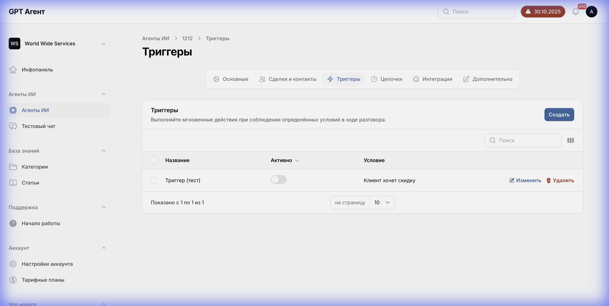

# Вкладка "Триггеры" (Triggers Tab)



## Общее описание
Вкладка "Триггеры" позволяет настраивать автоматические действия агента на основе определенных условий. Триггеры работают по принципу "если-то" (if-then): когда выполняется условие, срабатывает заданное действие.

## Структура интерфейса

### Заголовок секции
- **Текст**: "Триггеры"
- **Описание**: "Настройте автоматические действия агента на основе условий"

### Кнопка создания триггера
- **Расположение**: Правая часть заголовка секции
- **Текст**: "+ Создать триггер"
- **Тип**: Primary button
- **Цвет**: Синий
- **Функционал**: Открывает форму создания нового триггера

### Список триггеров

#### Состояние "Пусто"
- **Отображение**: Когда триггеров нет
- **Сообщение**: "У вас пока нет триггеров. Создайте первый триггер, чтобы автоматизировать действия агента"
- **Иконка**: Иконка триггера (молния или шестеренка)
- **Текущее состояние**: Пусто (триггеров не создано)

#### Состояние "Список триггеров" (когда триггеры созданы)
Каждый триггер в списке отображается как карточка со следующими элементами:

##### Структура карточки триггера:
1. **Название триггера**
   - Расположение: Верхняя часть карточки
   - Шрифт: Жирный, крупный
   - Функционал: Идентификация триггера

2. **Переключатель активности**
   - Тип: Toggle switch
   - Расположение: Правая часть карточки
   - Состояния: ON/OFF
   - Функционал: Включает/выключает триггер

3. **Секция "Условия" (Conditions)**
   - Заголовок: "Когда:" или "Условия:"
   - Содержимое: Список условий срабатывания
   - Формат: "Поле [оператор] Значение"
   - Примеры:
     - "Статус сделки = Новая"
     - "Бюджет > 10000"
     - "Тег содержит 'VIP'"

4. **Секция "Действия" (Actions)**
   - Заголовок: "Тогда:" или "Действия:"
   - Содержимое: Список действий, которые выполнит агент
   - Примеры:
     - "Отправить сообщение в WhatsApp"
     - "Создать задачу"
     - "Изменить статус сделки"
     - "Назначить ответственного"

5. **Кнопки действий**
   - **Редактировать**: Иконка карандаша
   - **Удалить**: Иконка корзины
   - Расположение: Правая часть карточки или в меню "..."

## Модальное окно создания/редактирования триггера

### Структура формы триггера

#### 1. Поле "Название триггера"
- **Тип**: Текстовое поле
- **Обязательность**: Да
- **Placeholder**: "Например: Уведомление о новой сделке"

#### 2. Секция "Условия"
- **Заголовок**: "Когда выполняются условия"
- **Кнопка**: "+ Добавить условие"

##### Структура условия:
- **Поле 1**: Выпадающий список выбора поля
  - Источник: Поля из CRM (сделки, контакты)
  - Примеры: "Статус сделки", "Бюджет", "Тег", "Дата создания"

- **Поле 2**: Выпадающий список оператора
  - Зависит от типа выбранного поля
  - Для текста: "равно", "не равно", "содержит", "не содержит"
  - Для числа: "равно", "не равно", ">", "<", ">=", "<="
  - Для даты: "равно", "до", "после", "между"

- **Поле 3**: Значение для сравнения
  - Тип зависит от выбранного поля
  - Текстовое поле, число, дата или выпадающий список

- **Логический оператор**: "И" / "ИЛИ" (для связи нескольких условий)

#### 3. Секция "Действия"
- **Заголовок**: "Выполнить действия"
- **Кнопка**: "+ Добавить действие"

##### Типы действий:
1. **Отправить сообщение**
   - Канал: WhatsApp, Email, SMS, Telegram
   - Получатель: Контакт, Ответственный, Другой
   - Текст сообщения: Текстовое поле с поддержкой переменных

2. **Создать задачу**
   - Название задачи
   - Описание
   - Ответственный
   - Срок выполнения

3. **Изменить поле CRM**
   - Выбор поля
   - Новое значение

4. **Назначить ответственного**
   - Выбор пользователя

5. **Добавить тег**
   - Выбор или создание тега

6. **Запустить цепочку**
   - Выбор цепочки из списка

#### 4. Кнопки управления
- **Сохранить**: Сохраняет триггер
- **Отмена**: Закрывает форму без сохранения

## Логика работы

### Сценарий создания триггера:
1. Пользователь нажимает "+ Создать триггер"
2. Открывается модальное окно с формой
3. Пользователь вводит название триггера
4. Пользователь добавляет одно или несколько условий
5. Пользователь добавляет одно или несколько действий
6. Пользователь нажимает "Сохранить"
7. Триггер добавляется в список и становится активным

### Сценарий срабатывания триггера:
1. Происходит событие в CRM (изменение поля, создание сделки и т.д.)
2. Система проверяет все активные триггеры
3. Если условия триггера выполнены, запускаются действия
4. Действия выполняются последовательно
5. Логируется результат выполнения

## API взаимодействие

### Получение списка триггеров:
- **Endpoint**: `GET /api/agents/{agentId}/triggers`
- **Response**:
  ```json
  {
    "triggers": [
      {
        "id": "trigger_id",
        "name": "Название триггера",
        "active": true,
        "conditions": [
          {
            "field": "deal_status",
            "operator": "equals",
            "value": "new"
          }
        ],
        "actions": [
          {
            "type": "send_message",
            "channel": "whatsapp",
            "recipient": "contact",
            "message": "Здравствуйте! Спасибо за обращение."
          }
        ]
      }
    ]
  }
  ```

### Создание триггера:
- **Endpoint**: `POST /api/agents/{agentId}/triggers`
- **Payload**: Структура триггера (см. выше)

### Обновление триггера:
- **Endpoint**: `PUT /api/agents/{agentId}/triggers/{triggerId}`

### Удаление триггера:
- **Endpoint**: `DELETE /api/agents/{agentId}/triggers/{triggerId}`

## Зависимости

- **CRM интеграция**: Триггеры работают с данными из CRM
- **Вкладка "Сделки и контакты"**: Доступные поля зависят от настроек доступа
- **Вкладка "Интеграции"**: Необходимы активные интеграции для отправки сообщений
- **Вкладка "Цепочки"**: Можно запускать цепочки из триггеров

## Валидация

- Название триггера: обязательное, не пустое
- Условия: минимум одно условие
- Действия: минимум одно действие
- Все поля условий и действий должны быть заполнены

## Состояния интерфейса

1. **Пустой список**: Показывается сообщение-заглушка
2. **Список с триггерами**: Отображаются карточки триггеров
3. **Модальное окно создания**: Форма для нового триггера
4. **Модальное окно редактирования**: Форма с заполненными данными
5. **Загрузка**: Индикатор при сохранении/удалении
6. **Ошибка**: Сообщения об ошибках валидации

## Примечания

- Триггеры выполняются в реальном времени при изменении данных в CRM
- Можно создать несколько триггеров с разными условиями
- Порядок выполнения действий важен
- Триггеры можно временно отключать без удаления
