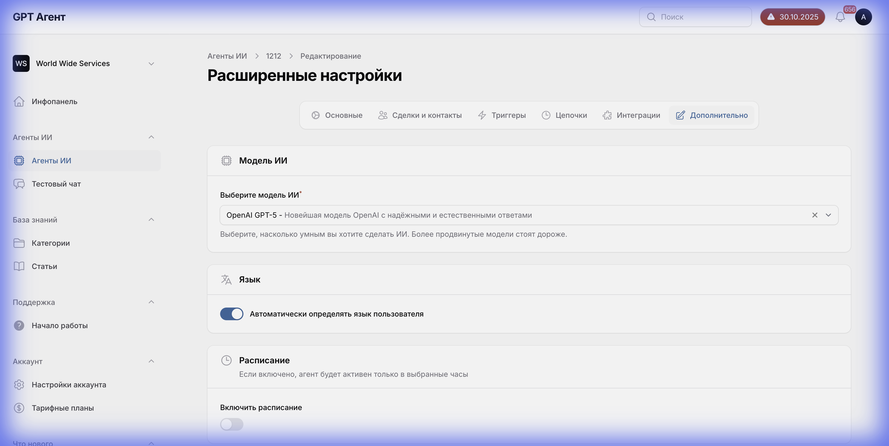

# Вкладка "Дополнительно" (Advanced Tab)



## Общее описание
Вкладка "Дополнительно" содержит расширенные настройки агента, включая выбор AI-модели, настройки языка и расписание работы.

## Структура интерфейса

### 1. Выбор AI-модели

#### Заголовок
- **Текст**: "Модель ИИ"
- **Описание**: "Выберите модель искусственного интеллекта для агента"

#### Выпадающий список моделей
- **Тип**: Dropdown select
- **Расположение**: Под заголовком
- **Текущее значение**: Отображается выбранная модель

##### Доступные модели:
1. **GPT-4 Turbo**
   - Описание: "Самая мощная модель, лучшее качество ответов"
   - Скорость: Средняя
   - Стоимость: Высокая
   - Рекомендуется для: Сложных задач, требующих глубокого понимания

2. **GPT-4**
   - Описание: "Мощная модель с отличным качеством"
   - Скорость: Средняя
   - Стоимость: Высокая
   - Рекомендуется для: Стандартных задач с высоким качеством

3. **GPT-3.5 Turbo**
   - Описание: "Быстрая и экономичная модель"
   - Скорость: Высокая
   - Стоимость: Низкая
   - Рекомендуется для: Простых задач, большого объема запросов

4. **Claude 3 Opus**
   - Описание: "Модель Anthropic с отличным пониманием контекста"
   - Скорость: Средняя
   - Стоимость: Высокая

5. **Claude 3 Sonnet**
   - Описание: "Сбалансированная модель Anthropic"
   - Скорость: Высокая
   - Стоимость: Средняя

6. **Claude 3 Haiku**
   - Описание: "Быстрая модель Anthropic"
   - Скорость: Очень высокая
   - Стоимость: Низкая

#### Информация о модели
При выборе модели отображается:
- **Описание**: Краткое описание возможностей
- **Контекстное окно**: Размер (например, "128K токенов")
- **Скорость**: Индикатор скорости ответа
- **Стоимость**: Относительная стоимость использования
- **Рекомендации**: Для каких задач подходит

---

### 2. Определение языка

#### Заголовок
- **Текст**: "Определение языка"
- **Описание**: "Автоматически определять язык сообщений пользователя"

#### Переключатель
- **Тип**: Toggle switch
- **Расположение**: Справа от заголовка
- **Состояния**:
  - **ON (включено)**: Агент автоматически определяет язык и отвечает на нем
  - **OFF (выключено)**: Агент использует язык по умолчанию

#### Дополнительные настройки (при включении)
- **Язык по умолчанию**: Выпадающий список
  - Русский
  - Английский
  - Украинский
  - Другие языки

- **Поддерживаемые языки**: Multi-select
  - Выбор языков, которые агент может использовать
  - Если язык не поддерживается, используется язык по умолчанию

---

### 3. Расписание работы

#### Заголовок
- **Текст**: "Расписание работы"
- **Описание**: "Настройте время, когда агент активен"

#### Переключатель
- **Тип**: Toggle switch
- **Расположение**: Справа от заголовка
- **Состояния**:
  - **ON (включено)**: Агент работает по расписанию
  - **OFF (выключено)**: Агент работает 24/7

#### Настройки расписания (при включении)

##### Рабочие дни
- **Тип**: Чекбоксы для каждого дня недели
- **Опции**:
  - ☑ Понедельник
  - ☑ Вторник
  - ☑ Среда
  - ☑ Четверг
  - ☑ Пятница
  - ☐ Суббота
  - ☐ Воскресенье

##### Рабочие часы
- **Начало работы**: Time picker (например, "09:00")
- **Конец работы**: Time picker (например, "18:00")

##### Часовой пояс
- **Тип**: Выпадающий список
- **Опции**: Все часовые пояса
- **По умолчанию**: Часовой пояс аккаунта

##### Действие вне рабочего времени
- **Тип**: Radio buttons или выпадающий список
- **Опции**:
  1. **Не отвечать**: Агент не обрабатывает сообщения
  2. **Автоответ**: Отправить сообщение о нерабочем времени
  3. **Переадресация**: Переадресовать на другого агента/оператора

##### Текст автоответа (если выбран "Автоответ")
- **Тип**: Текстовое поле (многострочное)
- **Placeholder**: "Спасибо за обращение! Наши рабочие часы: Пн-Пт 9:00-18:00. Мы ответим вам в ближайшее рабочее время."
- **Поддержка переменных**: {{next_working_time}}, {{current_time}} и т.д.

---

### 4. Дополнительные параметры (возможные)

#### Температура модели
- **Тип**: Slider (0.0 - 2.0)
- **Описание**: "Контролирует креативность ответов"
- **По умолчанию**: 0.7
- **Подсказка**: 
  - 0.0-0.3: Более предсказуемые ответы
  - 0.4-0.9: Сбалансированные ответы
  - 1.0-2.0: Более креативные ответы

#### Максимальная длина ответа
- **Тип**: Number input
- **Единица**: Токены
- **Диапазон**: 100 - 4000
- **По умолчанию**: 1000

#### Контекст разговора
- **Тип**: Number input
- **Описание**: "Сколько предыдущих сообщений учитывать"
- **Диапазон**: 1 - 50
- **По умолчанию**: 10

---

## Логика работы

### Сценарий выбора модели:
1. Пользователь открывает выпадающий список моделей
2. Система показывает доступные модели с описаниями
3. Пользователь выбирает модель
4. Отображается информация о выбранной модели
5. Пользователь сохраняет изменения
6. Агент начинает использовать новую модель

### Сценарий настройки расписания:
1. Пользователь включает переключатель "Расписание работы"
2. Появляются настройки расписания
3. Пользователь выбирает рабочие дни
4. Пользователь устанавливает рабочие часы
5. Пользователь выбирает действие вне рабочего времени
6. Если выбран автоответ, вводит текст сообщения
7. Пользователь сохраняет настройки
8. Агент работает по установленному расписанию

## API взаимодействие

### Получение доступных моделей:
- **Endpoint**: `GET /api/ai-models`
- **Response**:
  ```json
  {
    "models": [
      {
        "id": "gpt-4-turbo",
        "name": "GPT-4 Turbo",
        "provider": "openai",
        "description": "...",
        "context_window": 128000,
        "cost_per_1k_tokens": 0.01,
        "speed": "medium"
      }
    ]
  }
  ```

### Сохранение расширенных настроек:
- **Endpoint**: `PUT /api/agents/{agentId}/advanced-settings`
- **Payload**:
  ```json
  {
    "ai_model": "gpt-4-turbo",
    "language_detection": true,
    "default_language": "ru",
    "supported_languages": ["ru", "en", "uk"],
    "schedule": {
      "enabled": true,
      "working_days": [1, 2, 3, 4, 5],
      "working_hours": {
        "start": "09:00",
        "end": "18:00"
      },
      "timezone": "Europe/Moscow",
      "outside_hours_action": "auto_reply",
      "auto_reply_message": "..."
    },
    "temperature": 0.7,
    "max_tokens": 1000,
    "context_messages": 10
  }
  ```

## Зависимости

- **Выбор модели**: Влияет на качество и стоимость ответов агента
- **Расписание**: Влияет на доступность агента для пользователей
- **Определение языка**: Влияет на качество коммуникации с многоязычными клиентами

## Валидация

- Модель должна быть выбрана из доступного списка
- Рабочие часы: начало должно быть раньше конца
- Минимум один рабочий день должен быть выбран
- Температура: 0.0 - 2.0
- Максимальная длина ответа: положительное число

## Состояния интерфейса

1. **Стандартные настройки**: Значения по умолчанию
2. **Расписание выключено**: Скрыты настройки расписания
3. **Расписание включено**: Показаны все настройки расписания
4. **Определение языка выключено**: Скрыты языковые настройки
5. **Сохранение**: Индикатор загрузки
6. **Ошибка**: Сообщения об ошибках валидации

## Примечания

- Выбор модели влияет на стоимость использования агента
- Более мощные модели дают лучшие результаты, но стоят дороже
- Расписание полезно для бизнесов с определенными рабочими часами
- Автоматическое определение языка улучшает пользовательский опыт
