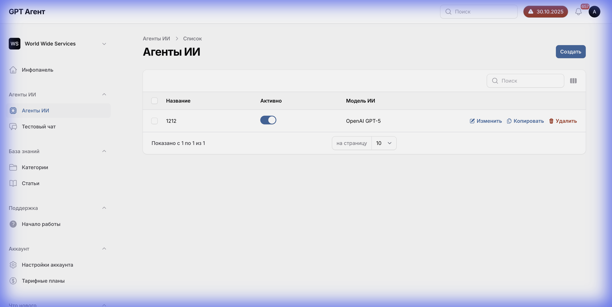
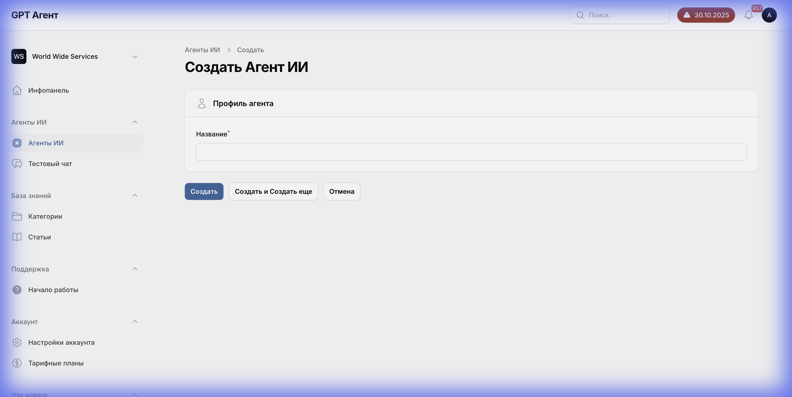

# Дизайн-Система и UI

Этот документ содержит точные параметры дизайн-системы, собранные из браузера, для обеспечения pixel-perfect соответствия.

## 1. Цветовая палитра

### Основные цвета
- **Primary Blue**: `rgb(3, 105, 161)` (#0369a1)
  - Использование: Основные кнопки ("Создать", "Сохранить"), активные элементы.
- **Error Red**: `rgb(239, 68, 68)` (#ef4444)
  - Использование: Текст ошибок валидации, иконки ошибок.
- **Text Dark**: `rgb(9, 9, 11)` (#09090b)
  - Использование: Основной текст, заголовки, активные вкладки.
- **Border Gray**: `rgb(113, 113, 122)` (#71717a)
  - Использование: Границы полей ввода (input borders).

### Фоны
- **Active Tab Background**: `rgb(250, 250, 250)` (#fafafa)
- **Page Background**: `rgb(255, 255, 255)` (#ffffff)

---

## 2. Типографика

**Font Family**:
```css
font-family: Inter, ui-sans-serif, system-ui, sans-serif, "Apple Color Emoji", "Segoe UI Emoji", "Segoe UI Symbol", "Noto Color Emoji";
```

---

## 3. Компоненты UI

### Кнопки (Primary)
```css
background-color: rgb(3, 105, 161);
color: rgb(255, 255, 255);
border-radius: 8px;
padding: 8px 12px;
font-weight: 500; /* Medium */
```

### Поля ввода (Inputs)
```css
border: 1px solid rgb(113, 113, 122);
border-radius: 8px; /* Предположительно, соответствует кнопкам */
padding: 6px 12px;
background-color: #ffffff;
```

### Вкладки (Tabs)
- **Активная вкладка**:
  - Фон: `rgb(250, 250, 250)`
  - Текст: `rgb(9, 9, 11)`
  - Индикатор: Обычно нижняя граница или выделение цветом (Primary Blue)

---

## 4. Валидация и Ошибки

### Сообщения об ошибках
- **Текст ошибки**: "Обязательно для заполнения."
- **Визуализация**:
  - Красная рамка у поля ввода
  - Красный текст ошибки под полем
  - Иконка восклицательного знака (опционально)


---

## 5. Главная страница и Создание агента

### Список агентов
Страница содержит таблицу со списком агентов.
- **Колонки**: Имя, Статус, Дата создания (предположительно).
- **Действия**: Кнопка "Создать" (сверху справа), меню действий у каждого агента (Изменить, Удалить).



### Создание агента
Модальное окно или отдельная страница (судя по скриншоту - страница).
- **Поля**:
  - Название (обязательное)
  - Возможно, выбор шаблона (если есть)
- **Кнопки**: "Создать", "Отмена".


