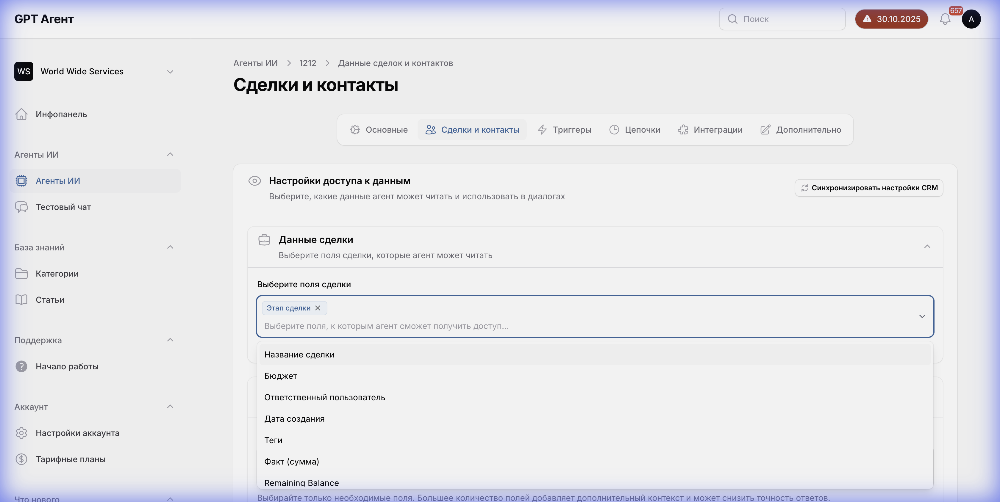
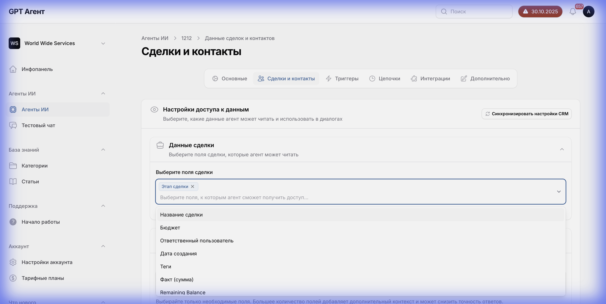
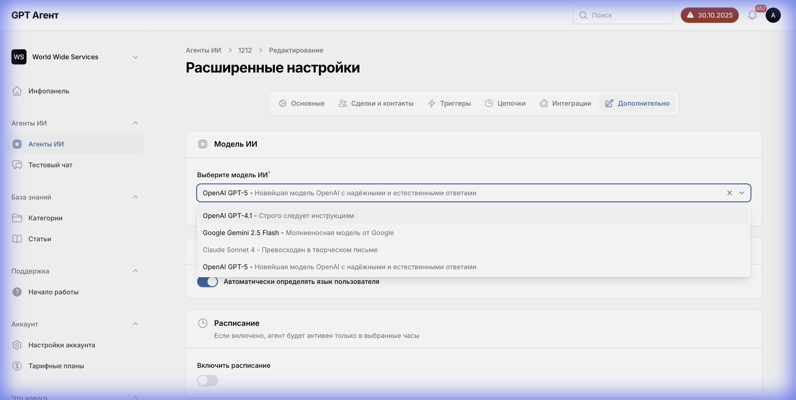
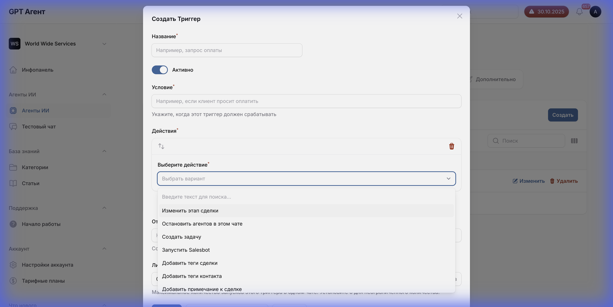
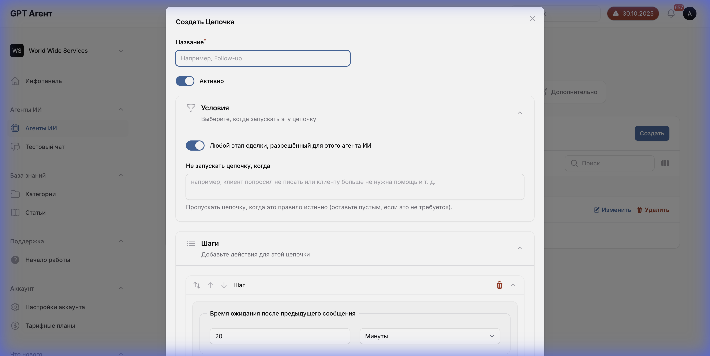
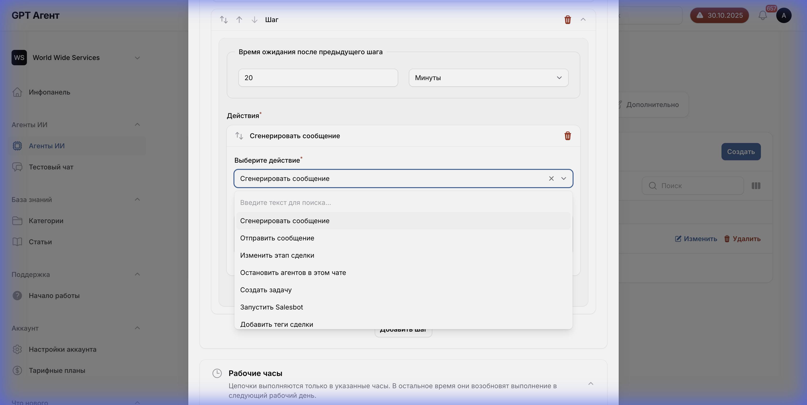

# Детальная Документация Выпадающих Списков и Зависимостей

## Общая информация
Этот документ содержит полную информацию обо всех выпадающих списках в приложении, их опциях и зависимостях между элементами.

---

## 1. Вкладка "Сделки и контакты"

### 1.1 Выпадающий список "Поля сделки"



**Тип**: Multi-select dropdown с чекбоксами

**Доступные опции**:
1. ☑ **Этап сделки** (предвыбрано)
2. ☐ **Название сделки**
3. ☐ **Бюджет**
4. ☐ **Ответственный пользователь**
5. ☐ **Дата создания**
6. ☐ **Теги**
7. ☐ **Факт (сумма)**
8. ☐ **Remaining Balance**

**Источник данных**: API CRM (Kommo/amoCRM)

**Логика работы**:
- Можно выбрать несколько полей одновременно
- Выбранные поля отображаются как чипы под выпадающим списком
- Каждый чип можно удалить кнопкой "×"
- По умолчанию выбрано "Этап сделки"

**API запрос для получения полей**:
```
GET /api/crm/fields/leads
```

**Зависимости**:
- Требуется активная интеграция с CRM (вкладка "Интеграции")
- Список полей динамический и зависит от настроек CRM

---

### 1.2 Выпадающий список "Поля контакта"



**Тип**: Multi-select dropdown с чекбоксами

**Доступные опции**:
1. ☑ **Имя контакта** (предвыбрано)
2. ☐ **Ответственный пользователь**
3. ☐ **Дата создания**
4. ☐ **Теги**
5. ☐ **Должность**
6. ☐ **Компания**
7. ☐ **Телефон**
8. ☐ **Email**

**Источник данных**: API CRM (Kommo/amoCRM)

**Логика работы**:
- Аналогично полям сделки
- По умолчанию выбрано "Имя контакта"

**API запрос**:
```
GET /api/crm/fields/contacts
```

---

## 2. Вкладка "Дополнительно"

### 2.1 Выпадающий список "Модель ИИ"



**Тип**: Single-select dropdown

**Доступные опции**:

1. **OpenAI GPT-4.1**
   - Описание: "Мощная модель с улучшенным пониманием контекста"

2. **Google Gemini 2.5 Flash**
   - Описание: "Быстрая модель Google с отличной производительностью"

3. **Claude Sonnet 4**
   - Описание: "Сбалансированная модель Anthropic"

4. ☑ **OpenAI GPT-5** (выбрано по умолчанию)
   - Описание: "Новейшая модель OpenAI с надёжными и естественными ответами"

**Источник данных**: Конфигурация системы

**Логика работы**:
- Можно выбрать только одну модель
- При выборе модели отображается её описание
- Выбранная модель используется для всех ответов агента

**API запрос**:
```
GET /api/ai-models
```

**Формат данных модели**:
```json
{
  "id": "openai-gpt-5",
  "name": "OpenAI GPT-5",
  "provider": "openai",
  "description": "Новейшая модель OpenAI с надёжными и естественными ответами",
  "context_window": 128000,
  "cost_per_1k_tokens": 0.015
}
```

---

## 3. Вкладка "Триггеры"

### 3.1 Модальное окно "Создать триггер"



#### 3.1.1 Выпадающий список "Выберите действие"

**Тип**: Single-select dropdown

**Доступные действия**:

1. **Изменить этап сделки**
   - Дополнительные поля при выборе:
     - Выпадающий список "Выберите этап" (список этапов из CRM)

2. **Остановить агентов в этом чате**
   - Дополнительных полей нет
   - Действие: Останавливает всех AI-агентов в текущем чате

3. **Создать задачу**
   - Дополнительные поля:
     - Текстовое поле "Название задачи"
     - Текстовое поле "Описание задачи"
     - Выпадающий список "Ответственный" (список пользователей)
     - Date picker "Срок выполнения"

4. **Запустить Salesbot**
   - Дополнительные поля:
     - Выпадающий список "Выберите Salesbot" (список доступных salesbot'ов)

5. **Добавить теги сделки**
   - Дополнительные поля:
     - Multi-select "Выберите теги" (список существующих тегов)
     - Возможность создать новый тег

6. **Добавить теги контакта**
   - Дополнительные поля:
     - Multi-select "Выберите теги"

7. **Добавить примечание к сделке**
   - Дополнительные поля:
     - Текстовое поле "Текст примечания" (многострочное)
     - Поддержка переменных: {{имя}}, {{компания}} и т.д.

8. **Добавить примечание к контакту**
   - Дополнительные поля:
     - Текстовое поле "Текст примечания"

**Логика работы**:
- При выборе действия появляются соответствующие дополнительные поля
- Можно добавить несколько действий к одному триггеру
- Действия выполняются последовательно

**Зависимости**:
- Список этапов зависит от настроек воронки в CRM
- Список Salesbot'ов загружается из CRM
- Список пользователей загружается из аккаунта

---

## 4. Вкладка "Цепочки"

### 4.1 Модальное окно "Создать цепочку"

#### 4.1.1 Выпадающий список "Единица времени задержки"



**Тип**: Single-select dropdown

**Доступные опции**:
1. **минут**
2. **часов**
3. **дней**

**Логика работы**:
- Используется в шаге "Задержка"
- Комбинируется с числовым полем (например, "5 минут", "2 часа", "1 день")

---

#### 4.1.2 Выпадающий список "Действие шага"



**Тип**: Single-select dropdown

**Доступные действия**:

1. **Сгенерировать сообщение**
   - Дополнительные поля:
     - Текстовое поле "Промпт для генерации"
     - Чекбокс "Использовать контекст разговора"
   - Описание: AI генерирует сообщение на основе промпта

2. **Отправить сообщение**
   - Дополнительные поля:
     - Текстовое поле "Текст сообщения" (многострочное)
     - Поддержка переменных
   - Описание: Отправляет заранее заданное сообщение

3. **Изменить этап сделки**
   - Аналогично триггерам

4. **Остановить агентов в этом чате**
   - Аналогично триггерам

5. **Создать задачу**
   - Аналогично триггерам

6. **Запустить Salesbot**
   - Аналогично триггерам

7. **Добавить теги сделки**
   - Аналогично триггерам

8. **Добавить теги контакта**
   - Аналогично триггерам

9. **Добавить примечание к сделке**
   - Аналогично триггерам

10. **Добавить примечание к контакту**
    - Аналогично триггерам

11. **Изменить ответственного**
    - Дополнительные поля:
      - Выпадающий список "Выберите пользователя"

**Логика работы**:
- Каждый шаг цепочки имеет своё действие
- Действия выполняются последовательно с учетом задержек
- Между шагами можно добавлять задержки
- Порядок шагов можно менять (drag-and-drop)

**Уникальные действия для цепочек** (не доступны в триггерах):
- "Сгенерировать сообщение" - использует AI для создания персонализированного контента
- "Изменить ответственного" - меняет ответственного за сделку/контакт

---

## 5. Условные зависимости

### 5.1 Зависимость полей от выбранного действия

#### Действие: "Изменить этап сделки"
```
Выбрано действие → Появляется выпадающий список "Этап"
                  → Список этапов загружается из CRM
                  → Зависит от воронки продаж
```

#### Действие: "Создать задачу"
```
Выбрано действие → Появляются поля:
                  1. Название задачи (Text input, обязательное)
                     - Placeholder: "Например: Связаться с клиентом"
                  2. Описание задачи (Textarea, необязательное)
                     - Placeholder: "Детали задачи..."
                  3. Ответственный (Dropdown)
                     - Список загружается из CRM (Users)
                     - По умолчанию: Текущий ответственный за сделку
                  4. Срок выполнения (Date/Time picker)
                     - Опции: "Сегодня", "Завтра", "Через 3 дня", "Выбрать дату"
                  5. Тип задачи (Dropdown, опционально)
                     - "Связаться", "Встреча", и т.д. (из настроек CRM)
```

#### Действие: "Добавить теги"
```
Выбрано действие → Появляется multi-select "Теги"
                  → Загружаются существующие теги из CRM
                  → Можно создать новый тег (кнопка "+ Создать тег")
                  → При создании нового тега появляется поле "Название тега"
```

#### Действие: "Сгенерировать сообщение" (только в цепочках)
```
Выбрано действие → Появляются поля:
                  - Промпт для генерации (textarea)
                  - Чекбокс "Использовать контекст разговора"
                  → Если чекбокс включен, появляется поле:
                    - Number input "Количество сообщений контекста" (1-50)
```

---

## 6. Общие паттерны

### 6.1 Паттерн Multi-select с чекбоксами
Используется в:
- Поля сделки
- Поля контакта
- Выбор тегов

**Поведение**:
1. Клик открывает список с чекбоксами
2. Можно выбрать несколько опций
3. Выбранные опции отображаются как чипы
4. Клик вне списка закрывает его
5. Чипы можно удалять индивидуально

### 6.2 Паттерн Single-select
Используется в:
- Модель AI
- Действия триггеров/цепочек
- Единицы времени

**Поведение**:
1. Клик открывает список
2. Можно выбрать только одну опцию
3. При выборе список закрывается
4. Выбранная опция отображается в поле

### 6.3 Паттерн Cascading Dropdowns (Каскадные выпадающие списки)
Используется в:
- Действия → Дополнительные поля

**Поведение**:
1. Выбор в первом dropdown определяет, какие поля появятся дальше
2. Дополнительные поля появляются динамически
3. При смене выбора в первом dropdown, дополнительные поля сбрасываются

---

## 7. API Endpoints для выпадающих списков

### 7.1 CRM данные (Синхронизация)

**Что подтягивается из CRM:**
1. **Поля сделок**: Только те, что выбраны во вкладке "Сделки и контакты".
2. **Поля контактов**: Только те, что выбраны во вкладке "Сделки и контакты".
3. **Пользователи**: Полный список активных пользователей (для назначения ответственных).
4. **Воронки и этапы**: Полная структура воронок продаж.
5. **Теги**: Все существующие теги сделок и контактов.
6. **Типы задач**: Настроенные в CRM типы задач.

**Endpoints:**
```
GET /api/crm/fields/leads - Поля сделок
GET /api/crm/fields/contacts - Поля контактов
GET /api/crm/pipelines - Воронки продаж
GET /api/crm/stages - Этапы воронок
GET /api/crm/tags - Теги
GET /api/crm/users - Пользователи CRM
GET /api/crm/salesbots - Salesbot'ы
GET /api/crm/task-types - Типы задач
```

### 7.2 Системные данные
```
GET /api/ai-models - AI модели
GET /api/timezones - Часовые пояса
GET /api/languages - Языки
```

---

## 8. Валидация

### Обязательные поля:
- Действие триггера/цепочки: должно быть выбрано
- При выборе "Создать задачу": название задачи обязательно
- При выборе "Изменить этап": этап должен быть выбран

### Ограничения:
- Задержка в цепочке: положительное число
- Количество сообщений контекста: 1-50
- Максимум 10 действий в одном триггере
- Максимум 20 шагов в одной цепочке
