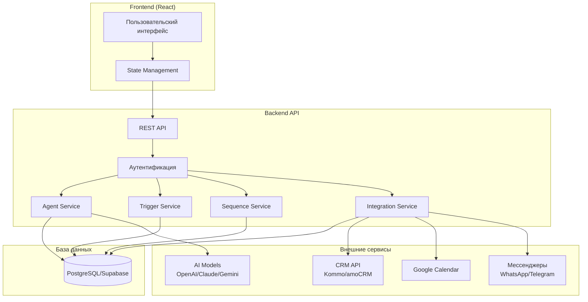
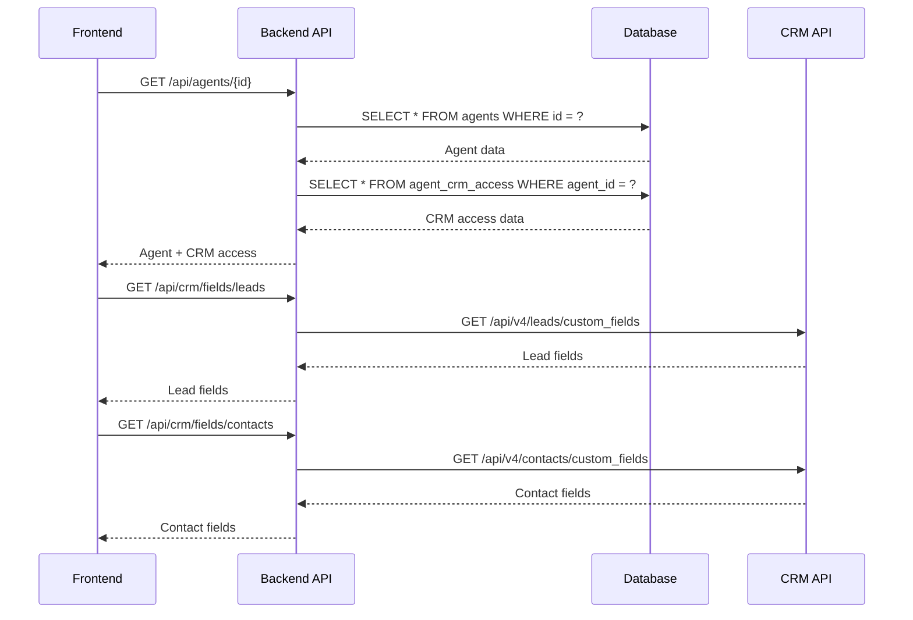
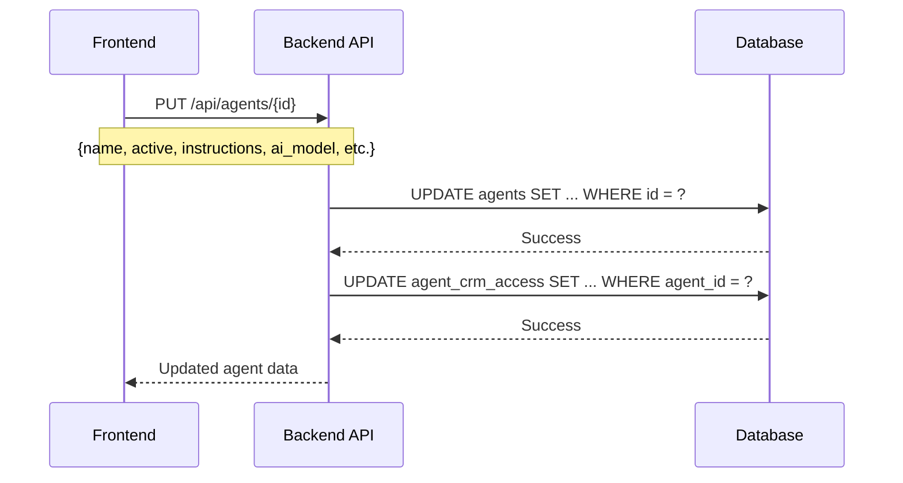
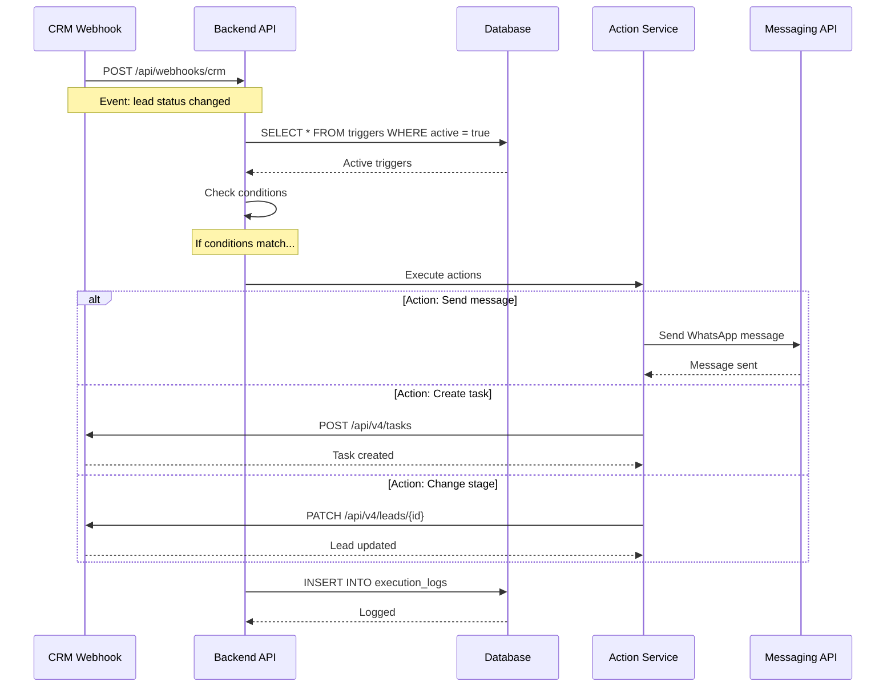
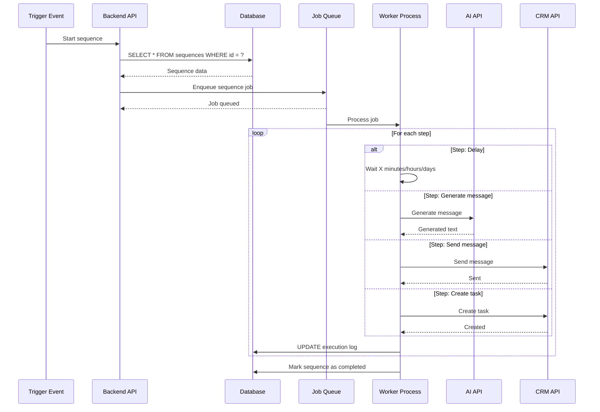
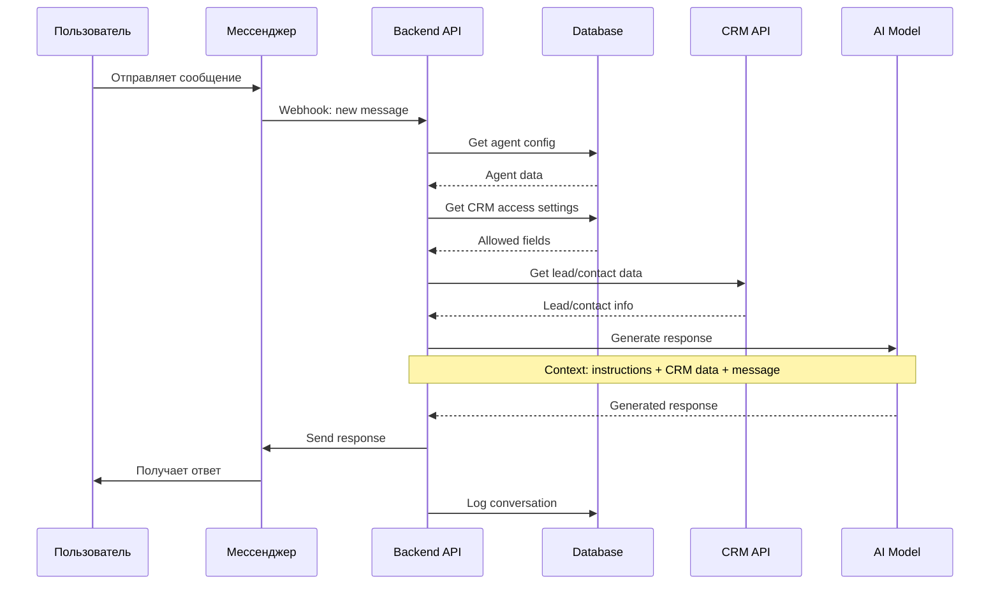

# Потоки Данных и Источники

## Общая архитектура



---

## 1. Источники данных

### 1.1 Локальная база данных

**Технология**: PostgreSQL (через Supabase)

**Хранимые данные**:
- Агенты (agents)
- Триггеры (triggers)
- Цепочки (sequences)
- Настройки интеграций (integrations)
- Пользователи (users)
- История выполнения (execution_logs)

**Схема таблиц**:

```sql
-- Таблица агентов
CREATE TABLE agents (
    id SERIAL PRIMARY KEY,
    user_id INTEGER REFERENCES users(id),
    name VARCHAR(255) NOT NULL,
    active BOOLEAN DEFAULT true,
    instructions TEXT,
    ai_model VARCHAR(100),
    language_detection BOOLEAN DEFAULT false,
    default_language VARCHAR(10),
    schedule JSONB,
    created_at TIMESTAMP DEFAULT NOW(),
    updated_at TIMESTAMP DEFAULT NOW()
);

-- Таблица настроек CRM доступа
CREATE TABLE agent_crm_access (
    id SERIAL PRIMARY KEY,
    agent_id INTEGER REFERENCES agents(id),
    lead_fields JSONB, -- массив ID полей
    contact_fields JSONB, -- массив ID полей
    created_at TIMESTAMP DEFAULT NOW()
);

-- Таблица триггеров
CREATE TABLE triggers (
    id SERIAL PRIMARY KEY,
    agent_id INTEGER REFERENCES agents(id),
    name VARCHAR(255) NOT NULL,
    active BOOLEAN DEFAULT true,
    conditions JSONB, -- массив условий
    actions JSONB, -- массив действий
    created_at TIMESTAMP DEFAULT NOW()
);

-- Таблица цепочек
CREATE TABLE sequences (
    id SERIAL PRIMARY KEY,
    agent_id INTEGER REFERENCES agents(id),
    name VARCHAR(255) NOT NULL,
    description TEXT,
    active BOOLEAN DEFAULT true,
    trigger_config JSONB,
    steps JSONB, -- массив шагов
    created_at TIMESTAMP DEFAULT NOW()
);

-- Таблица интеграций
CREATE TABLE integrations (
    id SERIAL PRIMARY KEY,
    agent_id INTEGER REFERENCES agents(id),
    integration_type VARCHAR(100), -- 'google_calendar', 'kommo', etc.
    config JSONB, -- конфигурация интеграции
    credentials JSONB, -- зашифрованные учетные данные
    active BOOLEAN DEFAULT true,
    created_at TIMESTAMP DEFAULT NOW()
);
```

---

### 1.2 CRM API (Kommo/amoCRM)

**Базовый URL**: `https://{subdomain}.kommo.com/api/v4/`

**Аутентификация**: OAuth 2.0

**Используемые endpoints**:

#### Получение полей сделок
```
GET /api/v4/leads/custom_fields
```
**Response**:
```json
{
  "_embedded": {
    "custom_fields": [
      {
        "id": 123,
        "name": "Бюджет",
        "type": "numeric",
        "is_predefined": false
      }
    ]
  }
}
```

#### Получение полей контактов
```
GET /api/v4/contacts/custom_fields
```

#### Получение воронок и этапов
```
GET /api/v4/leads/pipelines
```
**Response**:
```json
{
  "_embedded": {
    "pipelines": [
      {
        "id": 1,
        "name": "Продажи",
        "_embedded": {
          "statuses": [
            {
              "id": 101,
              "name": "Новая",
              "sort": 1
            }
          ]
        }
      }
    ]
  }
}
```

#### Получение пользователей
```
GET /api/v4/users
```

#### Получение тегов
```
GET /api/v4/leads/tags
GET /api/v4/contacts/tags
```

#### Создание/обновление сделки
```
PATCH /api/v4/leads/{lead_id}
```

#### Создание задачи
```
POST /api/v4/tasks
```

#### Webhooks
CRM отправляет webhooks на наш сервер при событиях:
- Создание сделки
- Изменение статуса
- Добавление примечания
- Изменение полей

**Webhook URL**: `https://our-app.com/api/webhooks/crm`

---

### 1.3 AI Models API

#### OpenAI API
**Base URL**: `https://api.openai.com/v1/`

**Endpoint для чата**:
```
POST /chat/completions
```
**Request**:
```json
{
  "model": "gpt-4",
  "messages": [
    {
      "role": "system",
      "content": "Инструкции агента..."
    },
    {
      "role": "user",
      "content": "Сообщение пользователя"
    }
  ],
  "temperature": 0.7,
  "max_tokens": 1000
}
```

#### Anthropic Claude API
**Base URL**: `https://api.anthropic.com/v1/`

**Endpoint**:
```
POST /messages
```

#### Google Gemini API
**Base URL**: `https://generativelanguage.googleapis.com/v1beta/`

**Endpoint**:
```
POST /models/gemini-pro:generateContent
```

---

### 1.4 Google Calendar API

**Base URL**: `https://www.googleapis.com/calendar/v3/`

**Аутентификация**: OAuth 2.0

**Endpoints**:

#### Получение списка календарей
```
GET /users/me/calendarList
```

#### Создание события
```
POST /calendars/{calendarId}/events
```
**Request**:
```json
{
  "summary": "Встреча с клиентом",
  "description": "Обсуждение проекта",
  "start": {
    "dateTime": "2024-01-15T10:00:00+03:00",
    "timeZone": "Europe/Moscow"
  },
  "end": {
    "dateTime": "2024-01-15T11:00:00+03:00",
    "timeZone": "Europe/Moscow"
  },
  "attendees": [
    {
      "email": "client@example.com"
    }
  ]
}
```

#### Проверка занятости
```
POST /freeBusy
```

---

### 1.5 Мессенджеры API

#### WhatsApp Business API
**Provider**: Twilio / Meta Business

**Endpoint для отправки сообщения**:
```
POST /v1/messages
```
**Request**:
```json
{
  "to": "+79001234567",
  "type": "text",
  "text": {
    "body": "Текст сообщения"
  }
}
```

#### Telegram Bot API
**Base URL**: `https://api.telegram.org/bot{token}/`

**Endpoint**:
```
POST /sendMessage
```
**Request**:
```json
{
  "chat_id": 123456789,
  "text": "Текст сообщения"
}
```

---

## 2. Потоки данных по функциям

### 2.1 Загрузка страницы редактирования агента



---

### 2.2 Сохранение настроек агента



---

### 2.3 Срабатывание триггера



---

### 2.4 Выполнение цепочки



---

### 2.5 Обработка сообщения пользователя агентом



---

## 3. Кэширование и оптимизация

### 3.1 Кэшируемые данные

**CRM поля** (TTL: 1 час):
- Список полей сделок
- Список полей контактов
- Воронки и этапы
- Список пользователей

**AI модели** (TTL: 24 часа):
- Список доступных моделей
- Описания моделей

**Интеграции** (TTL: 1 час):
- Список доступных интеграций

### 3.2 Real-time обновления

**WebSocket соединения** для:
- Статус выполнения цепочек
- Уведомления о срабатывании триггеров
- Обновления статуса интеграций

---

## 4. Безопасность данных

### 4.1 Хранение учетных данных

**OAuth токены**:
- Хранятся в зашифрованном виде (AES-256)
- Автоматическое обновление refresh tokens
- Ротация токенов каждые 30 дней

**API ключи**:
- Хранятся в environment variables
- Не передаются на frontend
- Маскируются в логах

### 4.2 Права доступа

**Row Level Security (RLS)** в Supabase:
```sql
CREATE POLICY "Users can only access their own agents"
ON agents FOR ALL
USING (user_id = auth.uid());
```

---

## 5. Мониторинг и логирование

### 5.1 Логируемые события

- Все API запросы
- Срабатывания триггеров
- Выполнение цепочек
- Ошибки интеграций
- AI запросы и ответы

### 5.2 Метрики

- Количество активных агентов
- Среднее время ответа
- Успешность выполнения триггеров/цепочек
- Использование AI токенов
- Ошибки API
