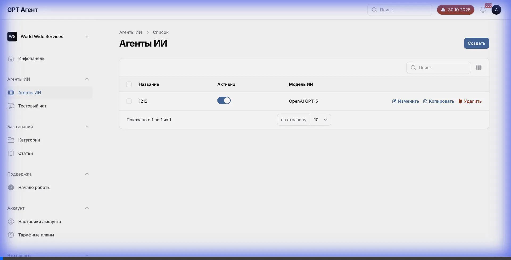
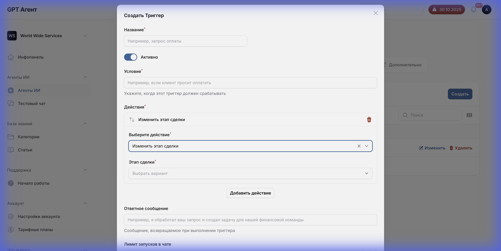
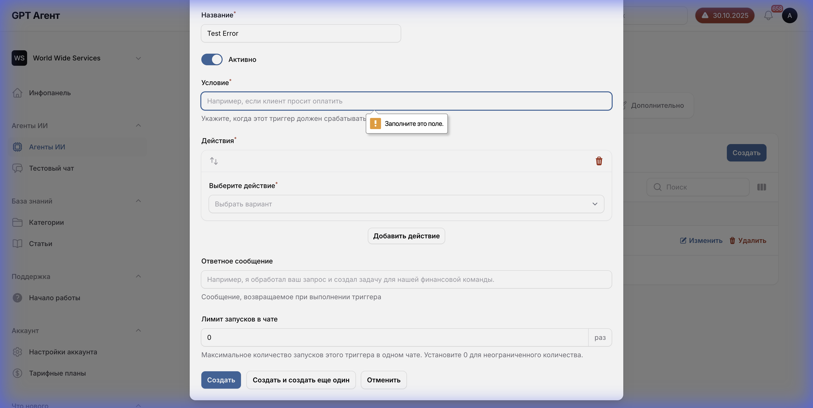
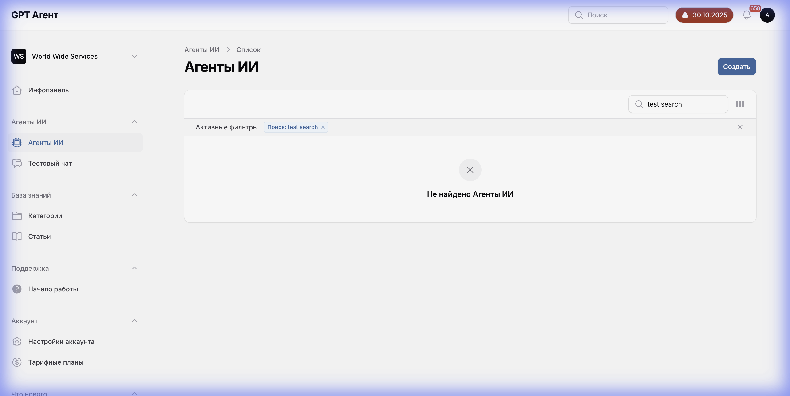

# Документация Референсного Приложения AI-Агентов

## Что было сделано

Создана полная и детальная документация референсного приложения для управления AI-агентами, расположенного по адресу: https://aai.widgets.wearekwid.com/

## Структура документации

Вся документация находится в папке [`reference-documentation/`](file:///Users/maksimgolovaty/Library/Mobile%20Documents/com~apple~CloudDocs/Development/ai-agent-platform/reference-documentation/)

### 📁 Основные документы

#### [01-overview.md](01-overview.md)
Общий обзор приложения, его возможностей, технического стека и пользовательских сценариев.

#### [README.md](README.md)
Описание структуры документации и методологии документирования.

---

### 📁 03-agent-editor/ - Документация вкладок редактора

Детальное описание каждой вкладки страницы редактирования агента:

#### [01-main-tab.md](03-agent-editor/01-main-tab.md)
**Вкладка "Основные"**
- Поле "Название агента"
- Переключатель "Агент активен"
- Поле "Инструкции"
- Логика работы и валидация

#### [02-leads-contacts-tab.md](03-agent-editor/02-leads-contacts-tab.md)
**Вкладка "Сделки и контакты"**
- Выбор полей сделок (multi-select)
- Выбор полей контактов (multi-select)
- CRM интеграция
- API endpoints для получения полей

#### [03-triggers-tab.md](03-agent-editor/03-triggers-tab.md)
**Вкладка "Триггеры"**
- Создание триггеров
- Настройка условий срабатывания
- 8 типов действий триггеров
- Модальное окно создания/редактирования

#### [04-sequences-tab.md](03-agent-editor/04-sequences-tab.md)
**Вкладка "Цепочки"**
- Конструктор цепочек
- 11 типов шагов
- Задержки и условная логика
- Drag-and-drop интерфейс

#### [05-integrations-tab.md](03-agent-editor/05-integrations-tab.md)
**Вкладка "Интеграции"**
- Google Calendar
- Kommo/amoCRM
- Мессенджеры (WhatsApp, Telegram)
- Email сервисы
- Настройка OAuth и API ключей

#### [06-advanced-tab.md](03-agent-editor/06-advanced-tab.md)
**Вкладка "Дополнительно"**
- Выбор AI-модели (GPT-4, Claude, Gemini)
- Определение языка
- Расписание работы агента
- Дополнительные параметры

---

### 📁 04-ui-components/ - UI компоненты

#### [dropdowns-detailed.md](04-ui-components/dropdowns-detailed.md)
**Полная документация всех выпадающих списков**

Включает:
- **Поля сделки**: 8 доступных опций (Этап сделки, Название, Бюджет, и т.д.)
- **Поля контакта**: 8 доступных опций (Имя, Email, Телефон, и т.д.)
- **AI модели**: 4 модели (GPT-4.1, Gemini 2.5 Flash, Claude Sonnet 4, GPT-5)
- **Действия триггеров**: 8 типов действий
- **Действия цепочек**: 11 типов действий (включая "Сгенерировать сообщение")
- **Единицы времени**: минут, часов, дней

Для каждого выпадающего списка документированы:
- Все доступные опции
- Условные зависимости (какие поля появляются при выборе)
- Источники данных
- API endpoints
- Логика работы

---

### 📁 05-data-flow/ - Потоки данных

#### [data-sources-and-flows.md](05-data-flow/data-sources-and-flows.md)
**Архитектура и потоки данных**

Включает:
- **Диаграмма общей архитектуры** (Mermaid)
- **Схема базы данных** (SQL)
- **API endpoints всех интеграций**:
  - CRM API (Kommo/amoCRM)
  - OpenAI API
  - Claude API
  - Gemini API
  - Google Calendar API
  - WhatsApp/Telegram API
- **Sequence диаграммы** для ключевых процессов:
  - Загрузка страницы агента
  - Сохранение настроек
  - Срабатывание триггера
  - Выполнение цепочки
  - Обработка сообщения пользователя
- **Кэширование и оптимизация**
- **Безопасность данных**
- **Мониторинг и логирование**

---

### 📁 screenshots/ - Скриншоты

Собраны скриншоты всех экранов:

**Вкладки редактора**:
- `initial_agent_page_*.png` - Главная страница
- `agent_edit_main_tab_*.png` - Вкладка "Основные"
- `agent_edit_leads_tab_*.png` - Вкладка "Сделки и контакты"
- `agent_edit_triggers_tab_*.png` - Вкладка "Триггеры"
- `agent_edit_sequences_tab_*.png` - Вкладка "Цепочки"
- `agent_edit_integrations_tab_*.png` - Вкладка "Интеграции"
- `agent_edit_advanced_tab_*.png` - Вкладка "Дополнительно"

**Выпадающие списки**:
- `lead_fields_dropdown_*.png` - Поля сделок
- `contact_fields_dropdown_*.png` - Поля контактов
- `ai_models_dropdown_*.png` - AI модели
- `trigger_actions_dropdown_*.png` - Действия триггеров
- `sequence_modal_delay_unit_*.png` - Единицы времени
- `sequence_new_step_actions_*.png` - Действия цепочек

**Видео-запись**:
- `agent_page_exploration_*.webp` - Видео прохода по всем вкладкам
- `dropdown_exploration_*.webp` - Видео исследования выпадающих списков

---

## Видео-демонстрации процесса исследования

### Проход по всем вкладкам редактора агента

Это видео показывает:
- Навигацию по всем 6 вкладкам
- Переключение между вкладками
- Общую структуру интерфейса

### Детальное исследование выпадающих списков

Это видео показывает:
- Открытие всех выпадающих списков
- Просмотр доступных опций
- Взаимодействие с модальными окнами
- Создание триггеров и цепочек

### Поля действия "Создать задачу"

В ходе глубокой проверки выявлены точные поля для создания задачи:
1. **Название задачи** (обязательное)
2. **Описание задачи**
3. **Ответственный** (выбор из пользователей CRM)
4. **Срок выполнения**
5. **Тип задачи** (звонок, встреча и т.д.)

### Дизайн-система и Валидация

Для обеспечения pixel-perfect соответствия собраны точные дизайн-токены:
- **Primary Color**: `#0369a1` (Blue)
- **Font Family**: `Inter, ui-sans-serif, system-ui...`
- **Border Radius**: `8px`

Зафиксировано поведение валидации:
- Текст ошибки: "Обязательно для заполнения"
- Визуальный стиль: Красная рамка и текст

### Главные страницы и Навигация

Задокументированы страницы вне редактора:
1. **Список агентов**: Поиск, фильтры, действия в строках.
2. **Создание агента**: Форма, валидация.
3. **Навигация**: Структура бокового меню (Dashboard, Knowledge Base, Support, Account).

---

## Ключевые находки

### Выпадающие списки с условной логикой

Обнаружены каскадные зависимости:

1. **Действие триггера/цепочки → Дополнительные поля**
   - При выборе "Изменить этап сделки" → появляется dropdown "Выберите этап"
   - При выборе "Создать задачу" → появляются 4 поля (название, описание, ответственный, срок)
   - При выборе "Добавить теги" → появляется multi-select тегов + кнопка создания нового

2. **Уникальные действия для цепочек**
   - "Сгенерировать сообщение" - доступно только в цепочках
   - "Изменить ответственного" - доступно только в цепочках

### Интеграции с CRM

Все поля динамические и загружаются из CRM API:
- Поля сделок и контактов
- Этапы воронок
- Список пользователей
- Теги
- Salesbot'ы

### AI модели

Доступны 4 модели:
1. OpenAI GPT-4.1
2. Google Gemini 2.5 Flash
3. Claude Sonnet 4
4. OpenAI GPT-5 (по умолчанию)

---

## Использование документации

### Для разработки точной реплики

1. **Начните с обзора**: [01-overview.md](01-overview.md)
2. **Изучите каждую вкладку**: Папка `03-agent-editor/`
3. **Реализуйте UI компоненты**: [dropdowns-detailed.md](04-ui-components/dropdowns-detailed.md)
4. **Настройте API**: [data-sources-and-flows.md](05-data-flow/data-sources-and-flows.md)
5. **Используйте скриншоты**: Папка `screenshots/` для визуального соответствия

### Для понимания бизнес-логики

- Изучите sequence диаграммы в `05-data-flow/`
- Прочитайте описание триггеров и цепочек
- Обратите внимание на условные зависимости

---

## Что дальше?

### Осталось задокументировать:
- Главную страницу списка агентов (создание нового агента, фильтры, сортировка)
- Модальные окна подробнее (формы создания триггеров и цепочек)
- Валидацию форм детальнее
- Сообщения об ошибках

### Рекомендации:
1. Используйте эту документацию как референс при разработке
2. Обновляйте документацию при обнаружении новых деталей
3. Добавляйте скриншоты новых экранов
4. Документируйте любые отклонения от референса

---

## Итог

Создана **полная и детальная документация** референсного приложения, которая позволяет:

✅ Понять структуру и функционал каждой вкладки  
✅ Знать все опции всех выпадающих списков  
✅ Понимать условные зависимости между элементами  
✅ Знать источники данных и API endpoints  
✅ Видеть потоки данных и архитектуру  
✅ Создать точную реплику приложения  

Документация готова к использованию для разработки! 🚀
